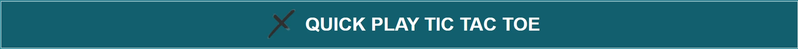

---

# QUICK PLAY TIC TAC TOE

Welcome to Quick Play Tic Tac Toe, the ultimate destination for fast-paced, two-player fun that will put your strategic skills to the test. Challenge a friend and see who can outsmart the other in this timeless classic, where every move brings you closer to victory!

With sleek design, instant gameplay, and no downloads required, you can jump into the action anytime, anywhere. Whether you're a seasoned player or a newcomer, Quick Play Tic Tac Toe offers endless excitement in every match!

The site can be accessed using this link, [QUICK PLAY TIC TAC TOE](https://tafadzwamangena.github.io/quick_play--tic-tac-toe/index.html)

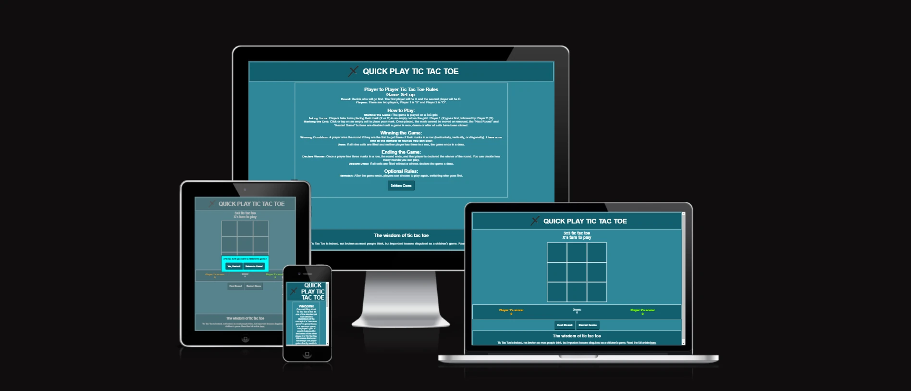

---

## User Experience (UX)

## User stories

- ### First Time Visitor Goals:

  - As a first time user, I am looking to understand the game rules. I want to know the basic rules and objectives of the game.
  - As a first time user, I want to get familiar with the website’s layout, navigation, and features to ensure that I can easily start and play a game.
  - I aim to the initial game play as a first time user to experience the website’s functionality and see how it operates.

- ### Returning Visitor Goals:

  - As a returning visitor I aim to improve my gameplay skills by playing more games and learning from my previous experiences.
  - As a returning visitor, I am looking into additional features such as different game modes, difficulty levels, or multiplayer options that I didn’t explore during my first visit.
  - As a returning user, I want to know my personal record and archivements. I want to check my personal statistics, achievements, or scores from previous games to track my progress.

- ### Frequent Visitor Goals:

  - As a frequent visitor, I am interested in competing against the computer, other players, either friends or online opponents, to challenge my skills and enjoy social interaction.
  - As a frequent user, I aim to participate in tournaments, challenges, or special events hosted on the website to test my abilities and earn rewards.
  - I am interested in customizing my gaming experience, such as changing themes, unlocking special features, or using advanced strategies to keep the game engaging and fresh as a frequent user.

- ### External User's Goal:

  - The external user is seeking for a quick game of tic tac toe to play right away without any sign ups or subscriptions.

- ### Site Owner's Goal:

  - The site owner's goal is to provide a fully functional tic tac toe game to for casual players.

---

## Features

- ### Logo Bar:

  - The logo bar is displayed in all pages, that is the Welcome page, the rules page and the game area page.
  - The Quick Tic Tac Toe logo and name are linked to the home and welcome page.

  

- ### The footer:

  - The footer section is placed at the bottom of each page with a heading of "The wisdom of tic tac toe" to highlight the user that the game is not just about placing your marks but also applying a certain wisdom to it.
  - The footer has an external link to [Medium.com](https://medium.com/age-of-awareness/the-wisdom-of-tic-tac-toe-18f2355905b3) to an article about tic tac toe. Important life lessons in nine moves.

  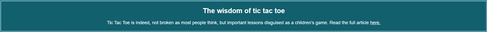

- ### Welcome Page:

  - The welcome page is meant to give insightful facts about the classic game of tic tac toe.
  - Also this page informs the players they have equal chance of winning the game yet one player's advantage is another's disadvantage.
  - Lastly the welcome page has an "Options to Play" button which directs them to the game rules page.

  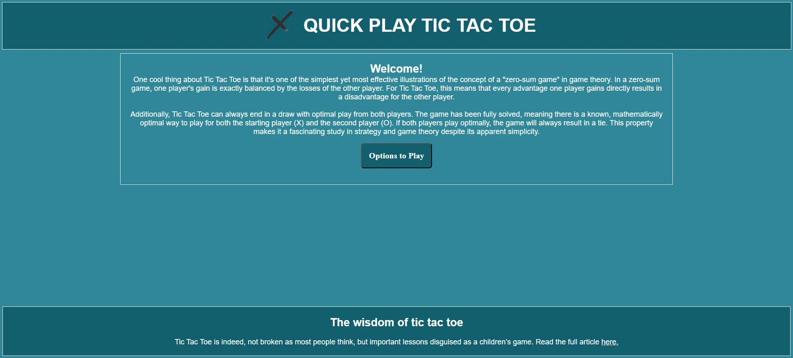

- ### Rules Page:

  - This page explains to the user how the tic tac toe game is set up and how to play the game.
  - Additionally, there is information also on the conditions of winning the game, how the game ends and also optional rules the players can decide on.
  - Lastly the page has a "Initialize Game" button which directs them to the game area.

  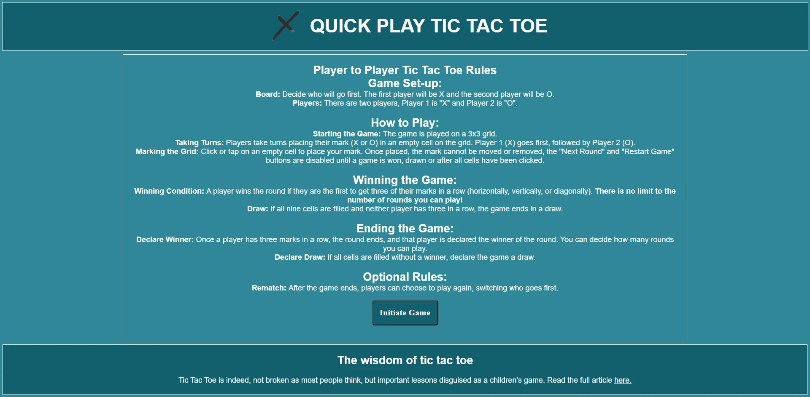

- ### Game Area Page:

  - The game area is the main page where all game activity takes place.
  - The game mode is displayed at the top of the game area, in this version 3x3 tic tac toe, to inform the users on the size of the grid and how many marks they need to line up.
  - The information space is right below the game mode area to inform the user's whose turn it is to play and also who has won the game or if a game ended in a draw.
  - The game grid is the section where users place their marks, X or O.
  - The results container is placed below the game grid to dispaly Player 1 and Player 2's scores as well as the games drawn.
  - Lastly the page has two buttons to play the next round and also to restart the game which redirects user to a dialog to confirm game restart.

  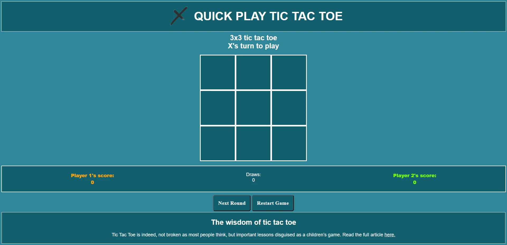

- ### Dialog:

  - The dialog is displayed Modally to stop the user from interacting with anything other than the dialog itself.
  - The user has two button options to restart the game or return to the current game.
  - Once either of the buttons is clicked the game returns to current game or new game.
  - Lastly the dialog has an aqua background and a backdrop of grey to make it visually attractive and easy to read.

  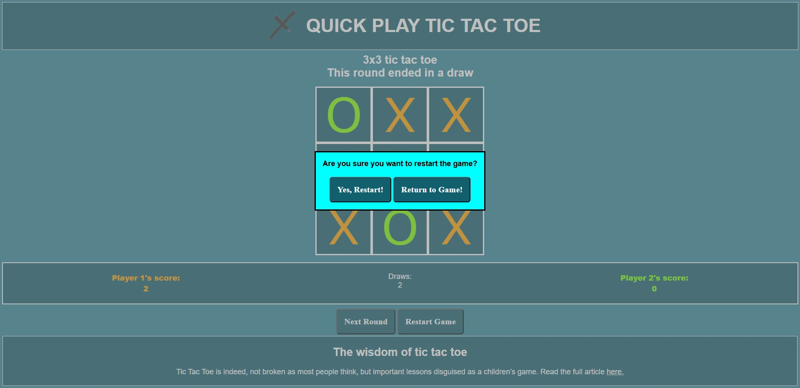

- ### Game Rules:

  1. Game Set-up: 
    - Board: Decide who will go first. The first player will be X and the second player will be O.
    - Players: There are two players, Player 1 is "X" and Player 2 is "O".

  2. How to Play:
    - Starting the Game: The game is played on a 3x3 grid.
    - Taking Turns: Players take turns placing their mark (X or O) in an empty cell on the grid. Player 1 (X) goes first, followed by Player 2 (O).
    - Marking the Grid: Click or tap on an empty cell to place your mark. Once placed, the mark cannot be moved or removed.

  3. Winning the Game: 
    - Winning Condition: A player wins the round if they are the first to get three of their marks in a row (horizontally, vertically, or diagonally). There is no limit to the number of rounds you can play!
    - Draw: If all nine cells are filled and neither player has three in a row, the game ends in a draw.

  4. Ending the Game:
    - Declare Winner: Once a player has three marks in a row, the round ends, and that player is declared the winner of the round. You can decide how many rounds you can play.
    - Declare Draw: If all cells are filled without a winner, declare the game a draw.

  5. Optional Rules:
    - Rematch: After the game ends, players can choose to play again, switching who goes first.

It is my game design solution (not a bug) that players can play on as many rounds they wish to without a maximum number of rounds that can be played.

- ### Features to implement:

  - In the future I intend to add an option to play against a computer.
  - I intent to expand the game options where the user's can select which game mode they want to play, 3x3, 4x4 or 5x5 tic tac toe.
  - It would be ideal for players to create their own profiles so they can track their progress and archivements.

---

## Design

- ### Color Scheme:

  - I chose Midnight Green, Blue Munsell, and White as the main colors for my website as the combination creates a visually appealing and effective color scheme.
  - The combination of Midnight Green, Blue Munsell, and White creates a harmonious and balanced color scheme. The deep green provides a solid foundation, the blue adds trustworthiness and clarity, and the white ensures simplicity and readability.
  - I chose to use Aqua and Grey as the main colors of the dialog to help user to focus on dialog.
  - Chartreuse and Orange are the mark ( "X" and "O") colors to give a vivid and bright impression.
  - The contrast between the dark and light colors is visually appealing and draws the viewer’s attention to key elements without being too stark or jarring.

  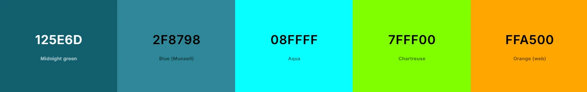

- ### Font:

  - Valera Round Google font is used as the main website font in order to increase visibility on the content in the website.
  - Times New Roman is used as the font on the buttons to differentiate them and make the content readible.
  - Verdana is the font used on the game grid due to it's bold weight and visibility.

  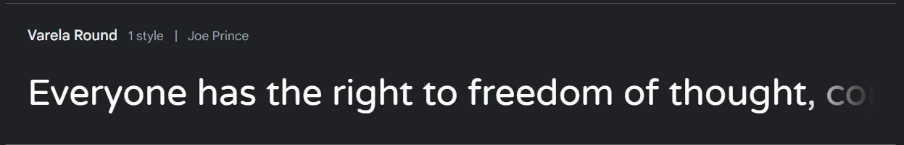

---

## Technologies Used

- ### Languages Used:

  - [HTML](https://en.wikipedia.org/wiki/HTML) : HTML was used as the skeleton and foundation of this website.
  - [CSS](https://en.wikipedia.org/wiki/CSS) : CSS was used to style and layout the website.
  - [JAVASCRIPT](https://en.wikipedia.org/wiki/JavaScript) : JavaScript was used to make the website interactive.

- ### Frameworks, Libaries & Programs Used:
  1.  [Google Fonts](https://fonts.google.com/) : Verela Round, Verdana and Times New Roman, Google fonts were used to give clear visibility of the text.
  2. [Gitpod](https://www.gitpod.io/) : was used as the main tool to write and edit code.
  3.  [Git](https://en.wikipedia.org/wiki/Git) : Git was used for the website version control.
  4.  [Github](https://en.wikipedia.org/wiki/GitHub) : GitHub is the website host.
  5.  [Balsamiq-Wireframes](https://balsamiq.com/wireframes/) : Balsamiq wireframes was used to create the wireframes of the website.
  6.  [Pexels.com](https://www.pexels.com/) : All images used in the website were downloaded from [pexels.com](https://www.pexels.com/).
  7.  [GIMP](https://www.gimp.org/) : GIMP was used to make images to .webp format.
  8.  [CSS-Flexbox](https://en.wikipedia.org/wiki/CSS_Flexible_Box_Layout) : was used to arrange items simmetrically on the pages.
  9. [CODEPEN](https://codepen.io/pen/) : was used to manipulate my code to determine it's functionality before adding to my code.
  
## Testing

- ### Compatibility

   - I tested this website in Chrome, Microsoft Edge, Opera and Firefox to make sure avery page works and is responsive.

   - #### Chrome
  [Chrome responsiveness](markdown/videos/responsive-chrome.webm)

   - #### Microsoft Edge
  [MS Edge responsiveness](markdown/videos/responsive-ms-edge.webm)

   - #### Firefox
  [Firefox responsiveness](markdown/videos/responsive-firefox.webm)

- ### Manual Testing

   - I confirmed all internal links work and all external links work being opened on a new tab.
   - I tested that that all cells blocks and buttons work as intented. When a winner is declared no more cells can be clicked.

- ### Responsiveness

   - I viewed the website in different screen sizes, small mobiles, large mobiles, tablets and laptops (using devtools) to ensure the text and images, colors etc are all clearly visible in different screen sizes.

---

## Validator Testing

I used Markup Validator, W3C CSS Validator Sevices and JShint to validate every page of the project, no errors were found.

- ### HTML

  - W3C Markup Validator - [Results]

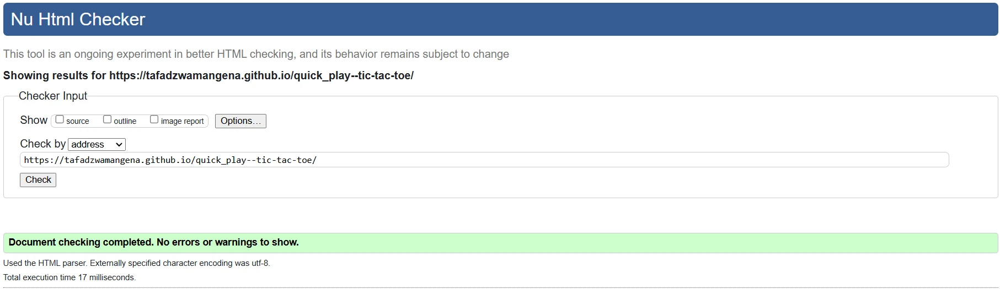

- ### CSS

  - W3C CSS Validator - [Results]

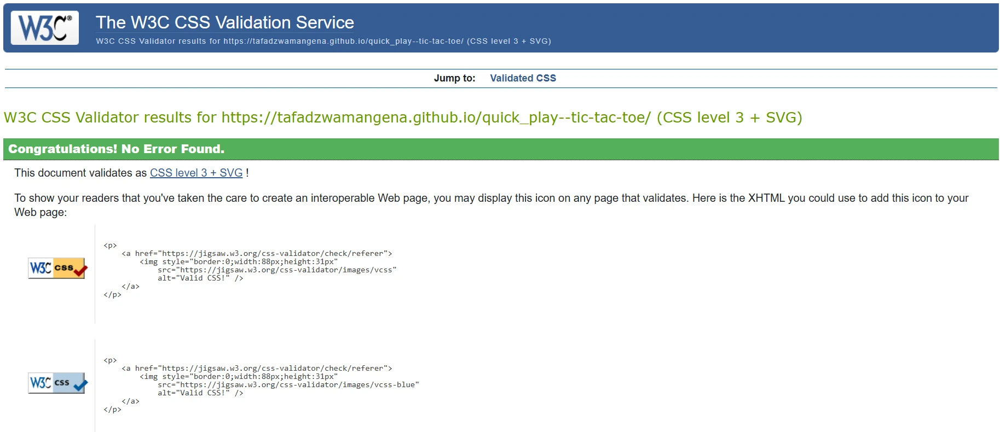
  
- ### JAVASCRIPT

  - JShint report - [Results]

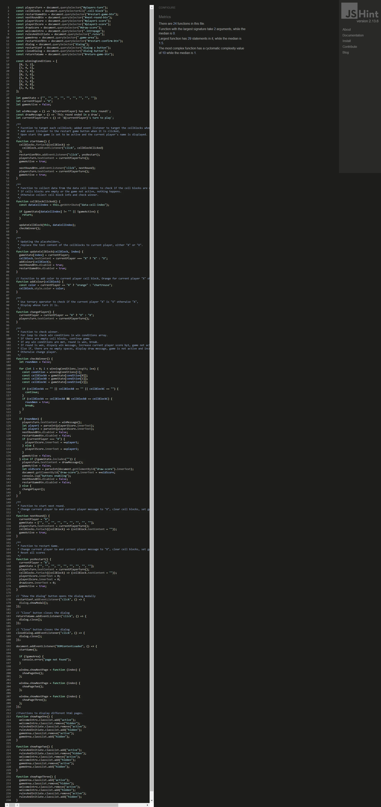
   

### Lighthouse Report

- Accessibility - I confirmed that the colors and fonts chosen are easy to read and accessible (in all pages) by running it through lighthouse in devtools.
- See below the results.

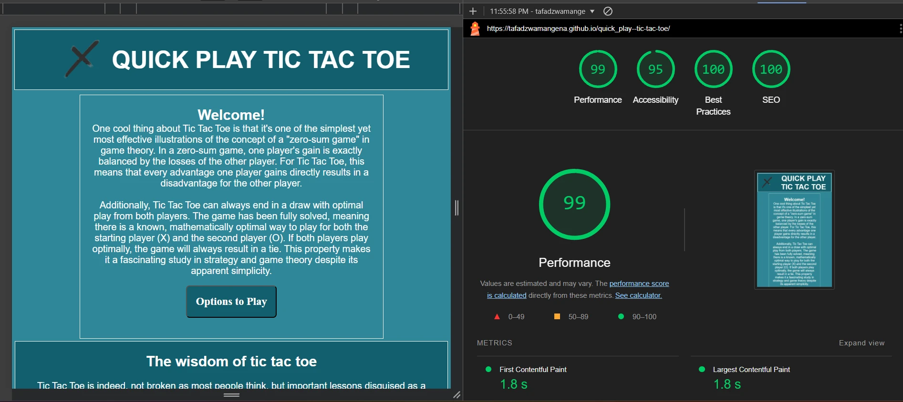

---

## Bugs

- ### Solved Bugs
    
  1. The cell blocks were highlighting with the player's color when click. Only the player mark, (X) or (O) should have color.

  _Solution_: I removed the border on cell blocks to fix this bug.

  2. The Next Round and Restart Game button where still disabaled even after the round is finished. This error/ bug was caused by the fact that I was disabling the buttons after calling the checkWinner function, but the checkWinner function is enabling the buttons, causing the disabled buttons to enable and instantly disable.

  _Solution_: I added console logs on the buttons to check their interaction and now disabled the buttons from the checkWinner function to the updateCellBlock function.

  3. JShint warning/error "Expected an assignment or function call and instead saw an expression." on score increament. 

  _Solution_: I replacement the ternary operator with an If statement. Currently on line 130 - 134 on JS.

- ### Unsolved Bugs

   1. None.  All discovered bugs were fixed. 

   - In case any bugs are discovered please flag on github.

---

## Deployment

### GitHub Pages Deployment

- The site was deployed to GitHub pages. The steps to deploy are as follows:
  - In the GitHub repository, navigate to the Settings tab,
  - From the source section drop-down menu, select the Master Branch,
  - Once the master branch has been selected, the page will be automatically refreshed with a detailed ribbon display to indicate the successful deployment.

The live link can be found [here](https://tafadzwamangena.github.io/quick_play--tic-tac-toe/)

---

## Credits

### Code

- This project was ceated using a full template provided by [Code Institute](https://github.com/Code-Institute-Org/ci-full-template).
- The README.md file was inspired by Code Institute with some changes.
- [MDN Web Docs](https://developer.mozilla.org/en-US/), was used to test and validate the code.
- I got the assistance in changing the colors of the players on [Stack Overflow](https://stackoverflow.com/).
- The game grid container was inspired by [Bro Code](https://www.youtube.com/@BroCodez)'s Youtube channel.
- I learnt and had a better understanding of enabling and disabling buttons on [HereWeCode](https://herewecode.io/blog/enable-and-disable-button-javascript/).
- I learnt and had a better understanding on Dialogs and Modals on [webdevsimplified.com](https://blog.webdevsimplified.com/).

### Content

- The information on the Welcome Page and Options and Rules Page was generated from [chatgpt](https://chatgpt.com/).
- The workout routines were taken from [health.com](https://www.health.com/).
- The article on the footer is from [Medium](https://medium.com/).

### Media

- The image used was downloaded from [pexels.com](https://www.pexels.com/)
- The image was converted to webp format using [GIMP](https://www.gimp.org/).

### Acknowledgements

- My wife was supportive thoughout the building of the website and gave me ideas.
- My Mentor has been a geat help giving insightful feedback.
- Tutor support at Code Institude.
- Slack community at Code Institude.